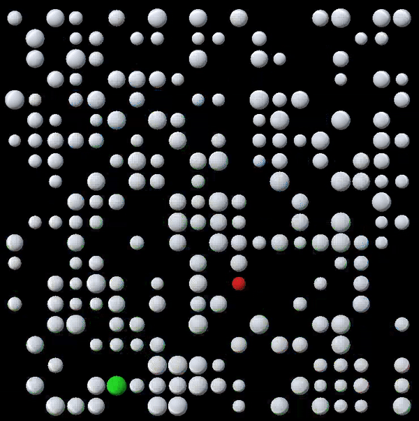

# Pathfinding Visualization - Dijkstra's Algorithm & A*

### See it in action: https://qualuo.github.io/dijkstras-algorithm/

Dijkstra's and A* pathfinding algorithm implemented in Unity with C#. 

## Visual
* Graph consists of a weighted 8-connectivity grid. 
* Red is the target. 
* Green (the brightest one) is starting point. 
* Blue nodes are the frontier/open/tentative nodes (that have a preliminary shortest distance). 
* Node size indicates weight (smaller = shorter). Size is relative.
* Longer paths are darker, while short and easy paths are brighter. Shade is relative.
* White lines show the shortest path to any node from the starting node. (Shortest-path tree)
* Random nodes are removed from the grid. 
* New scenarios are procedurally generated.
* The option to randomize weights will create more varied scenarios than uniform grid.

<p align="center">
  
</p>

## Algorithm

Dijkstra's algorithm is used in pathfinding to find the shortest path from one node to every other node. These are the steps:
1. Choose a starting node. This will be the first `current` node. (Passed into function.)
2. Add all graph nodes to a set. This set contains all `unvisited` nodes.
3. Set starting node's `distance` to `0`, and `∞` (represented with max value) for all others. The `distance` is the shortest distance to the node from starting node.
4. Set the `current` node to the one with lowest `distance` in the `unvisited` set.
5. Remove `current` node from set of `unvisited` nodes.
6. For every neighbor (connected vertex) of `current` node: if sum of `distance` to the neighbor is less than the neighbor's current `distance`, save the smaller value (shorter distance), and set a pointer/reference to neighbor.
7. Repeat from 4 until unvisited set is empty.

Looks along the lines of this in code: 
``` C#
        // Dijkstra's Shortest Path Algorithm implementation (no priority queue)
        void FindPathsDijkstra(List<List<GameObject>> nodesGrid, GameObject nodeInitial) {
            HashSet<GameObject> unvisited = new HashSet<GameObject>();

          foreach (List<GameObject> row in nodesGrid) {
              foreach (GameObject node in row) {
                  unvisited.Add(node);
                  if (node.Equals(nodeInitial)) {
                      Node n = node.GetComponent<Node>();
                      n.SetDist(0);
                  }
              }
          }

          GameObject nodeCurrent = nodeInitial;
          while (unvisited.Count > 0) {
              int min = int.MaxValue;
              foreach (GameObject o in unvisited) {
                  int d = o.GetComponent<Node>().GetTotalDist();
                  if (d <= min) {
                      min = o.GetComponent<Node>().GetTotalDist();
                      nodeCurrent = o;
                  }
              }
              unvisited.Remove(nodeCurrent);
              
              // Optional stop after target is found
              if (nodeCurrent.Equals(nodeTarget)) { 
                  isTargetFound = true;
                  break;
              }

              Node node = nodeCurrent.GetComponent<Node>();
              foreach (GameObject neighbor in node.GetNeighbors()) {
                  Node nodeNeighbor = neighbor.GetComponent<Node>();
                  int nxtDist = node.GetTotalDist() + nodeNeighbor.GetWeight();
                  if (nxtDist < nodeNeighbor.GetTotalDist()) {
                      nodeNeighbor.SetDist(nxtDist);
                      nodeNeighbor.SetPrev(nodeCurrent);
                  }
              }
          }
       }
```
       
## Comments 

Dijkstra's algorithm was originally implemented with its simplest form, using a set. This was made more efficient by using a priority queue to sort the frontier nodes for faster access. Unity just so happens to include a version of C# that doesn't have priority queue support.

The change from using a set to using a priority queue is in step 4 and 6 — finding the lowest 'distance' node by: iterating through all unvisited nodes, O(n) at step 4, versus dequeue first element, O(1), at step 4 and updating priority, O(log n), at step 6.

A* was added because of its popularity and generally performing better than Dijkstra. A* is simply put Dijkstra's but informed. It adds heuristics to find the desired target faster. The A* heuristic used here is the Euclidean distance. 

Making random scenarios by removing random nodes opened up the possibility of fragmented graphs within the grid. Dijkstra's algorithm can not tell if there is a path or not to the destination, so to remedy this validation was added with depth-first search. Breadth-first search is also an alternative.

## Ideas

Since this is a 3D project, it is simple to extend the visualization to the third dimension by adding another dimension and add more neighbors to every node (from 8-connectivity to 9+8+9=26). The bigger task however, is creating a good user experience along with it.

Applying this grid-based pathfinding in a non-discrete 2D or 3D world can be achieved by something along these lines, first assuming we are only navigating ground:
1. Choose a starting node.
    * That is — find any point on the ground.
2. Add all graph nodes to a set.
    * This is easier said than done (as is everything else), but what we can do is: 
        * From the starting point, traverse a `step` distance for every direction, along the ground. 
        * Every step is checked to not collide with anything. If nothing is in the way, then this is a neighbor, aka accessible point. Repeat this for every neighbor             until all accessible points have been found. 
        * We have now constructed the graph in the form of a navigation grid, and have the initial 'unvisited' set. 
        * From here we can procede with the pathfinding algorithm as usual.
3. Set starting node's `distance` to `0`, and `∞` (represented with max value) for all others.
4. Set the `current` node to the one with lowest `distance` in the `unvisited` set.
5. Remove `current` node from set of `unvisited` nodes.
6. For every neighbor (connected vertex) of `current` node: if sum of `distance` to the neighbor is less than the neighbor's current `distance`, save the smaller value (shorter distance), and set a pointer/reference to neighbor.
7. Repeat from 4 until unvisited set is empty.

And so we can now get to any other point from the single starting point!

* This whole process can be applied to every node, which will result in knowing the shortest path to any point, **from any point**.
* If the ground and obstacles don't change (they are static), then reconstructing the graph every time is not necessary and would be done beforehand so it only needs to be done once.
* Navigation becomes more complex by adding movement in the third dimension:
    * Jumping
        * For this, the previously ground-conforming grid will have to be extended upwards based on jump height and outwards based on movement speed. Higher levels and           points across gaps become part of the navigation grid.
        * The cheaper way of handling this, is manually connecting pairs of points as traversable gaps.
    * Falling — Dropping down from ledges.
    * Gliding — Falling while moving forward at the same time, a slanted extension of the grid.
    * Climbing — Extending navigation grid upwards along vertical shapes, walls. 
